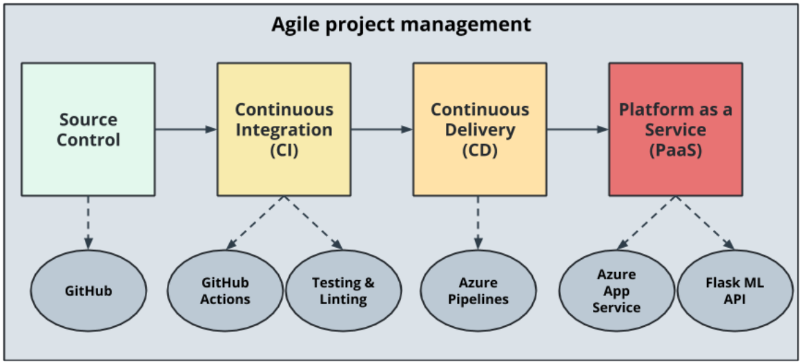

## Azure pipeline status badge
[](https://dev.azure.com/oyindaakinyemi/Flask-ML-Deploy/_build/latest?definitionId=3&branchName=master)

# Overview

A guide to deploying a CI/CD Pipeline for A Simple Flask App on Azure

## Project Plan

* A link to a [Trello board](https://trello.com/invite/b/yefsHO5q/93f994cbf11e4a0b3747ba61fe82d269/ci-cd-agile-sprint-board) for the project

* A link to a [spreadsheet](https://docs.google.com/spreadsheets/d/19OEz7wSu8wNykEoiUfyaQp43s2UQouRF6ffuhdbUr0Q/edit?usp=sharing
) spreadsheet that includes the original and final project plan.

## Demo video
[part 1](https://www.youtube.com/watch?v=eBoO8wVYjyw)
[part 2](https://www.youtube.com/watch?v=EbNs3f42qIc)

## Instructions for running this Python project:

Architectural Diagram (Showing how key parts of the system work)


   
1. Sign in with an existing account or signup to the Azure portal at https://portal.azure.com.
2. Click on the Cloud Shell button on the portal's toolbar to launch the azure cli:


3. Clone this repository
    ```
   git clone https://github.com/oyin-bam/flask-ml-service.git
   ```
4. In the Cloud Shell, run ```az webapp up``` to create an App Service and webapp automatically.
5. Search for aure devops organizations from the search bar and click on my azure devops organization. create new organization if you dont have one, or create new project in your existing organization if you have one.
6. Give new project a name, select vvisibility as public, create project
7. On the LHS of the the new project, click on pipelines, then create new pipeline, select github

8. It would prompt you to select the repo of choice from your github,, the to configure, choose the circled, select your subscription and then the webapp created earlier.

9. Then review the yml generated and click run.
10. The pipeline is built, and when it is approved it automatically deploys to our webapp.
11. go to the webapp in the azure portal, copy the app url and paste into the browser

12. to see the prediction. click the cloud shell icon shown in 2.
13. navigate into the repo you cloned earlier, make the script executable using
```
chmod +x make_predict_azure_app.sh
```
14. run the acript to see the prediction

15. from the portal in app service, the log stream of the deployed application

## Successfu run of the project in azure


## status badge for git actions


##live app url

[bam-flask-app](https://bam-flask-app.azurewebsites.net/)

## Note:

* For a successful deployment of the project in Azure Pipelines.  [Tofficial documentation should be referred as guide and double checked as you setup CI/CD](https://docs.microsoft.com/en-us/azure/devops/pipelines/ecosystems/python-webapp?view=azure-devops).


## Cleaning up resources

To avoid incurring ongoing charges for any Azure resources you created in this walkthrough, delete the resource group that contains the App Service and the App Service Plan.
```bash
az group delete
```

To delete the storage account that maintains the file system for Cloud Shell, which incurs a small monthly charge, delete the resource group that begins with cloud-shell-storage-.

## Enhancements

The Machine Learning model used in building this API is pre-trained. Therefore, to further generalize the implementation of this Continous Integration & Continous Deployment process, we could integrate the dataset training stage in the pipeline by employing the Azure Kubernetes Service (AKS) while leveraging relevant tools such as TensorFlow and KubeFlow to simplify the operation. In this architecture, the models will run in AKS clusters backed by GPU-enabled virtual machines.

For further information on this, see [ML model training](https://docs.microsoft.com/en-us/azure/architecture/solution-ideas/articles/machine-learning-model-deployment-aks).


